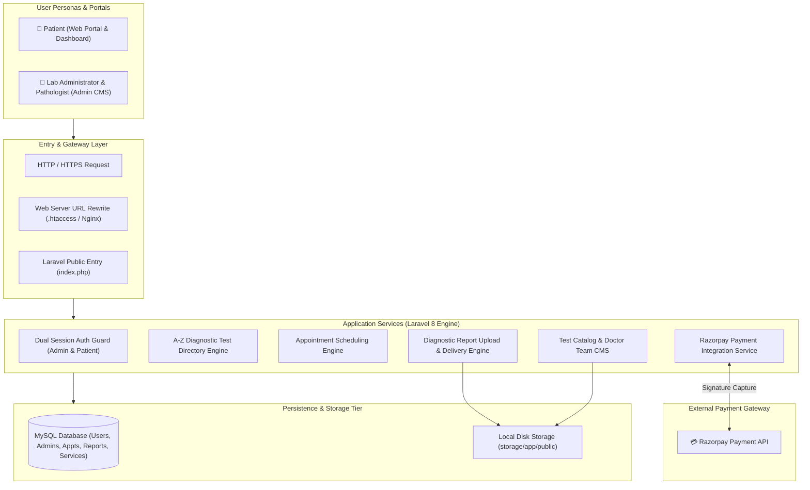
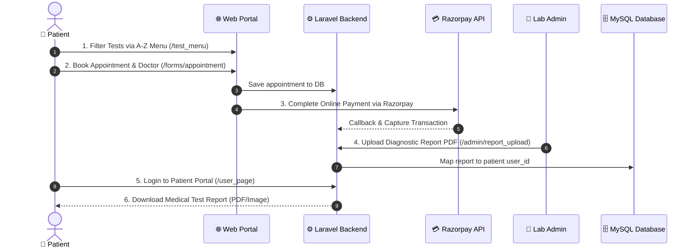

# 🩺 Medilab — Diagnostic Pathology Laboratory & Healthcare Management System

> **A full-stack clinical laboratory management platform featuring an A-Z diagnostic test directory, online appointment booking, Razorpay payment gateway integration, digital report delivery, and an administrative back-office CMS.**

[](https://www.php.net/)
[](https://laravel.com/)
[](https://www.mysql.com/)
[](https://razorpay.com/)
[](https://getbootstrap.com/)
[](LICENSE)

---

## 📌 Technical Showcase Overview

**Medilab** is an end-to-end diagnostic pathology and clinical healthcare platform engineered with **Laravel 8** and **MySQL**. It bridges the gap between diagnostic laboratories and patients by replacing physical queuing and paper records with self-service test exploration, online payment capture, automated appointment scheduling, and 24/7 digital medical report access.

---

## 💡 The Problem

Traditional diagnostic centers and standalone clinical laboratories face critical operational bottlenecks:

- **Unorganized Test Catalogs**: Patients frequently struggle to find test availability, sample prerequisites (e.g., 12-hour fasting), and current pricing.
- **Congested Reception Counters**: Walk-in registration and manual billing create long queues and administrative errors.
- **Physical Report Collection Overhead**: Patients are forced to make return visits to the clinic solely to collect printed paper lab reports.
- **Fragmented Payment Tracking**: Manual cash handling at counters complicates daily financial reconciliation.

---

## 🚀 The Solution: Medilab

Medilab provides a unified, full-stack digital healthcare workflow:

1. **Interactive A-Z Test Search Engine**: Instant filtering across clinical pathology tests with dynamic pricing and sample collection rules.
2. **Integrated Razorpay Payment Gateway**: Seamless online test and consultation fee transactions with automated signature verification.
3. **Patient Portal & 24/7 Report Delivery**: Authenticated patient dashboard for tracking appointments and downloading digital medical test results (PDF/images) uploaded by lab technicians.
4. **Dual Authentication Guard**: Dedicated security boundaries for Clinic Administrators (`admin_auth`) and Patients (`user_auth`).
5. **Full-Featured Back-Office CMS**: Management of diagnostic tests, appointment queues, doctor rosters, and patient health records.

---

## 🏗️ System Architecture at a Glance



---

## 🧩 Core Platform Components

| Subsystem | Primary Tech Stack | Description |
|---|---|---|
| **A-Z Test Directory Engine** | Laravel 8, Blade, JavaScript | Real-time alphabetical test search and price listing across pathology categories. |
| **Razorpay Payment Gateway** | `razorpay/razorpay: ^2.8`, REST API | Handles online fee transactions, signature verification, and automated payment capture. |
| **Patient Portal & Dashboard** | Laravel Session (`user_auth`), Blade | Personal dashboard for managing health profiles, appointment status, and report downloads. |
| **Digital Report Delivery** | Laravel Storage, Symlink, MySQL | Lab technicians upload diagnostic PDF/image reports linked directly to patient IDs. |
| **Appointment Scheduler** | Blade Forms, Eloquent ORM, MySQL | Dynamic scheduling engine with department, doctor selection, and booking queue. |
| **Admin Back-Office CMS** | Laravel Middleware (`admin_auth`), Bootstrap | Complete CRUD back-office for test pricing, doctor profiles, and patient health records. |

---

## 🔄 Diagnostic & Patient Lifecycle Flow



---

## 📚 Technical Documentation Index

Detailed architectural and engineering documentation is available in the repository:

### 📐 Architecture & Diagrams
- **[System Architecture](diagrams/system-architecture.md)** — Multi-tier service breakdown and entry gateway.
- **[Diagnostic Lifecycle Flow](diagrams/diagnostic-lifecycle-flow.md)** — Step-by-step sequence of test booking to report delivery.
- **[Database ERD](diagrams/database-erd.md)** — Relational data model and schema dictionary.
- **[Deployment Topology](diagrams/deployment-topology.md)** — Production server, Nginx, and PHP-FPM topology.

### 📦 Product Documentation
- **[Product Overview](docs/product/overview.md)** — Vision, problem space, and core business value.
- **[Public Web Portal](docs/product/public-portal.md)** — Patient UX, A-Z test menu, and booking views.
- **[Administrative CMS](docs/product/admin-cms.md)** — Back-office management, appointment queue, and report distribution.

### 🧪 Domain Design
- **[Pathology Test Directory](docs/domain/pathology-test-directory.md)** — Alphabetical search implementation and test metadata.
- **[Appointment Booking Engine](docs/domain/appointment-booking.md)** — Scheduling workflow and data structure.
- **[Digital Report Delivery](docs/domain/digital-report-delivery.md)** — Health record confidentiality and patient file mapping.

### ⚙️ Engineering & Architecture
- **[Razorpay Payment Integration](docs/engineering/razorpay-integration.md)** — API setup, signature validation, and capture mechanics.
- **[Dual Authentication & Security](docs/engineering/patient-auth-security.md)** — Admin & Patient session guards and Bcrypt encryption.
- **[Report Upload Engine](docs/engineering/report-upload-engine.md)** — Storage pipeline, file sanitization, and symlink distribution.
- **[Frontend Architecture](docs/engineering/frontend-architecture.md)** — Blade inheritance, Bootstrap 5, and UI engines.

---

## 🚀 Quickstart & Local Setup

```bash
# 1. Clone the repository
git clone https://github.com/YOUR_USERNAME/pathology-lab-management-system.git
cd pathology-lab-management-system/workspace

# 2. Install PHP dependencies
composer install

# 3. Create .env configuration file
cp .env.example .env
# (On Windows: copy .env.example .env)

# 4. Generate Application Encryption Key
php artisan key:generate

# 5. Configure Database & Razorpay credentials in .env:
# DB_DATABASE=project3
# RAZORPAY_KEY=your_key
# RAZORPAY_SECRET=your_secret

# 6. Run database migrations
php artisan migrate

# 7. Create storage symlink
php artisan storage:link

# 8. Start development server
php artisan serve
```

Access the application at: **[http://127.0.0.1:8000](http://127.0.0.1:8000)**

---

## 📄 License

This technical showcase and repository is open-sourced under the [MIT License](LICENSE).
