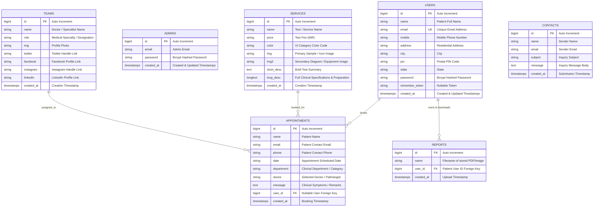

# 🗄️ Database Entity-Relationship Diagram (ERD)

The **Medilab** database is designed for normalized relational storage across patients, administrative staff, diagnostic tests, appointment bookings, digital reports, and customer inquiries.

---

## 📋 Data Dictionary & Relationships

1. **`users` ➔ `appointments` (1:N)**: A registered patient can book multiple lab appointments over time.
2. **`users` ➔ `reports` (1:N)**: An admin uploads one or more diagnostic report files (`reports.name`) associated with a single patient (`reports.user_id`).
3. **`services`**: Stores diagnostic pathology packages and individual blood/tissue tests with dynamic pricing and descriptions.
4. **`admins`**: Independent credential store protected by `admin_auth` session middleware.
