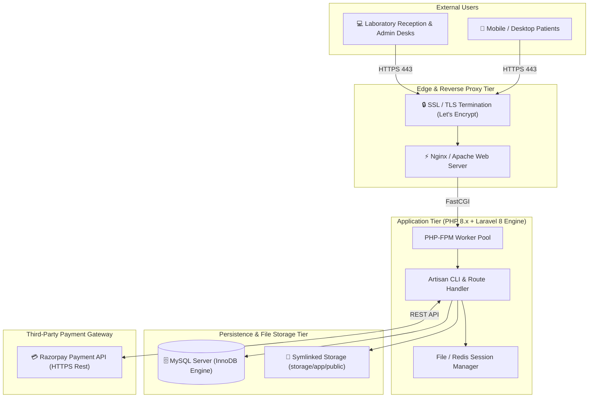

# 🌐 Deployment & Infrastructure Topology

This document details the production/staging deployment topology and server configuration for the **Medilab** Pathology Laboratory platform.

---

## 🛠️ Server Environment Specifications

- **Operating System**: Linux (Ubuntu 20.04/22.04 LTS) or Windows Server
- **Web Server**: Nginx or Apache with `mod_rewrite` enabled
- **PHP Version**: PHP 7.4 or 8.0+ with required extensions (`pdo_mysql`, `mbstring`, `openssl`, `tokenizer`, `xml`, `ctype`, `json`, `fileinfo`, `curl`)
- **Database Server**: MySQL 5.7 / 8.0 or MariaDB 10.4+
- **File Symlink**: `public/storage` linked to `storage/app/public`
