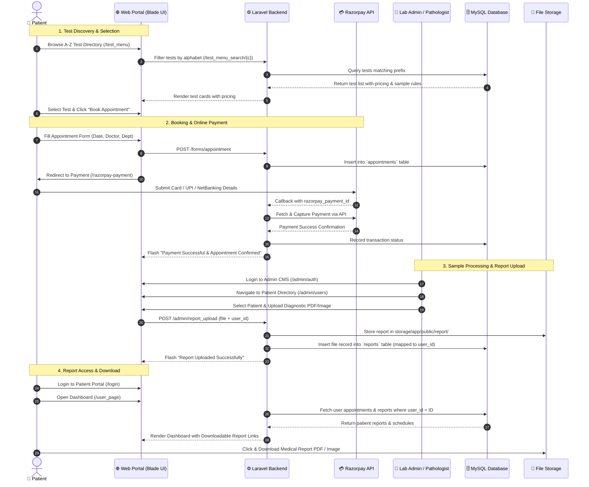

# 🔄 Diagnostic & Patient Lifecycle Flow

This sequence diagram illustrates the complete end-to-end lifecycle of a diagnostic test — from test discovery, appointment booking, and online payment to sample testing, digital report upload, and patient report download.

