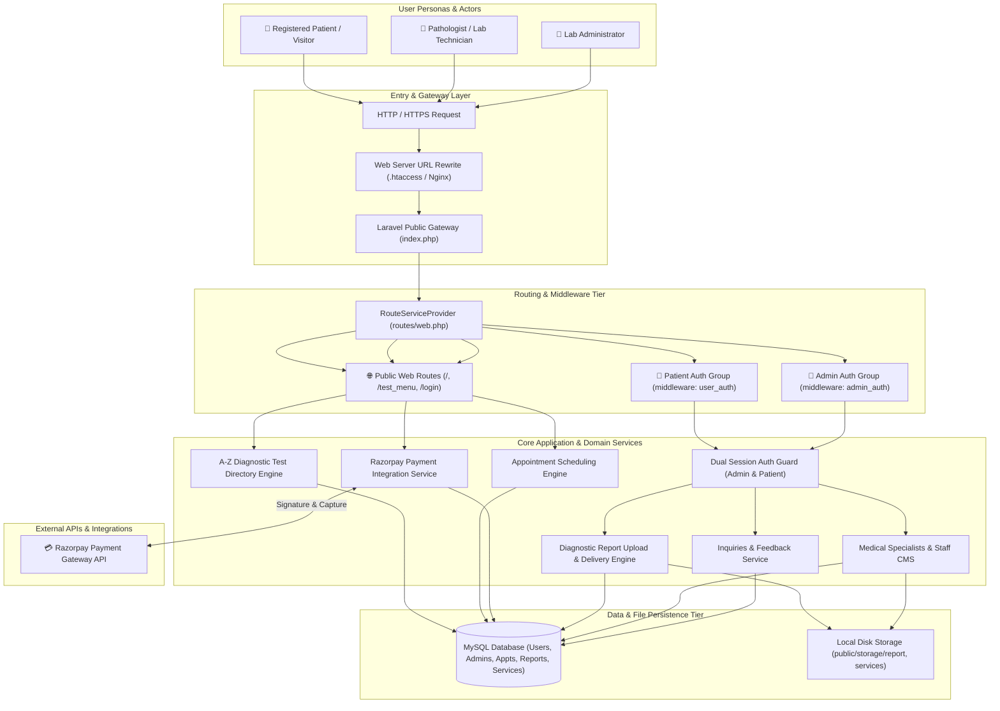

# 🗺️ System Architecture Diagram

This diagram visualizes the multi-tier architecture of the **Medilab Pathology Laboratory & Healthcare Platform**, illustrating user personas, entry routing, dual-guard authentication, core domain services, third-party payment gateways, and data persistence.

