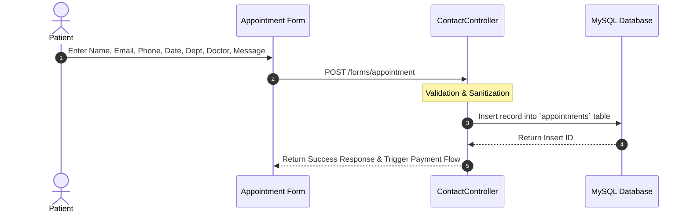

# 📅 Domain Design: Appointment Booking & Scheduling Engine

The Appointment Booking engine enables patients to schedule laboratory visits and clinical consultations.

---

## 🔄 Booking Workflow

---

## 🗄️ Appointment Record Structure

| Field | Type | Description |
|---|---|---|
| `name` | VARCHAR | Patient's full name |
| `email` | VARCHAR | Confirmation & notification email |
| `phone` | VARCHAR | Contact number for SMS / WhatsApp alerts |
| `date` | DATE | Preferred appointment date |
| `department` | VARCHAR | Selected department (Pathology, Cardiology, Radiology, etc.) |
| `doctor` | VARCHAR | Assigned doctor or laboratory specialist |
| `message` | TEXT | Clinical symptoms, prescription details, or custom notes |
| `user_id` | BIGINT (Nullable) | Foreign key link to registered patient account |
