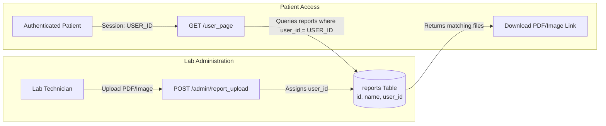

# 📑 Domain Design: Digital Diagnostic Report Delivery

The Digital Report Delivery module eliminates physical paper collection by providing a secure, authenticated channel for patients to access test results.

---

## 🔒 Confidentiality & Relational Architecture

Medical diagnostic reports contain sensitive personal health information (PHI). The delivery architecture ensures reports are only accessible by the authorized patient:



---

## ⚙️ Implementation Details

### 1. Upload Controller (`AdminController.php`):
```php
public function report_upload(Request $request)
{
    if ($request->hasFile('report')) {
        $report = $request->file('report');
        $ext = $report->extension();
        $report_name = time() . '.' . $ext;
        $report->storeAs('public/report', $report_name);

        DB::table('reports')->insert([
            'name' => $report_name,
            'user_id' => $request->post('user_id'),
            'created_at' => now()
        ]);
    }
    $request->session()->flash('message', 'Report Uploaded Successfully');
    return redirect('admin/users');
}
```

### 2. Patient Retrieval (`HomeController.php`):
```php
public function user_page()
{
    $id = session()->get('USER_ID');
    $data['user'] = DB::table('users')->where(['id' => $id])->get();
    $data['apnts'] = DB::table('appointments')->where(['user_id' => $id])->get();
    $data['reports'] = DB::table('reports')->where(['user_id' => $id])->get();
    return view('user_page', $data);
}
```
