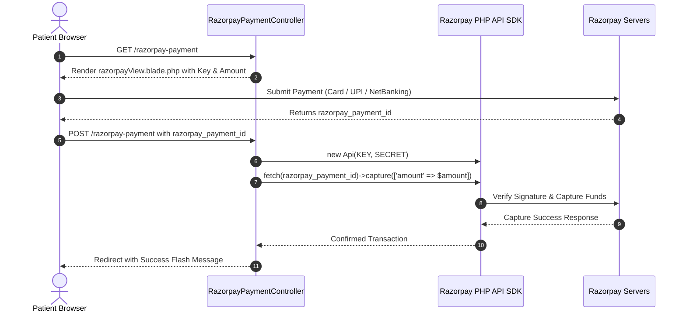

# 💳 Engineering: Razorpay Payment Gateway Integration

This document outlines the server-side and client-side integration of the **Razorpay Payment Gateway API** within Medilab.

---

## 🏗️ Architecture & SDK Setup

- **Package**: `razorpay/razorpay: ^2.8`
- **Controller**: `App\Http\Controllers\RazorpayPaymentController`
- **Configuration**:
  ```env
  RAZORPAY_KEY=rzp_test_xxxxxx
  RAZORPAY_SECRET=xxxxxx
  ```

---

## 🔄 Transaction Flow & Capture



---

## 🛡️ Error Handling & Idempotency
- All capture invocations are enclosed in `try ... catch (Exception $e)` blocks.
- Failed captures flash user-friendly error messages and redirect gracefully back to the checkout view without crashing the session.
